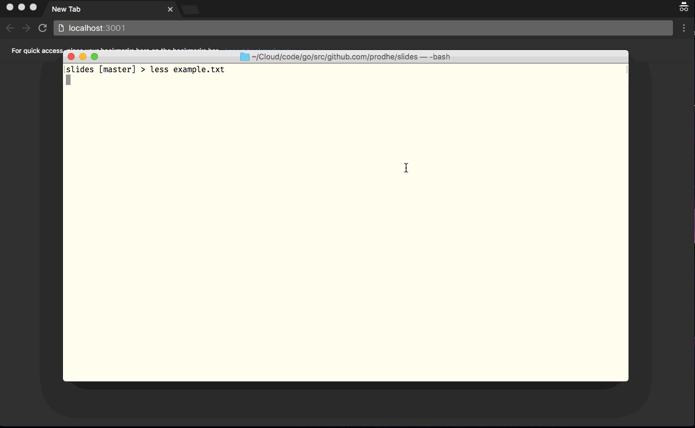

# Slides

Create a web browser based slide show from extremely simple markup. Have a new slide show ready in seconds!

This is pretty much a go clone of *sent* from suckless.org (https://tools.suckless.org/sent/) for the browser instead of X11.

It also serves as a way for me to try out lexing/parsing in Go. The lexer is based on Rob Pike's talk "Lexical Scanning in Go" ([youtube](https://www.youtube.com/watch?v=HxaD_trXwRE)) and a lot of the methods are almost direct copies of the template/parse package.

## Syntax

- Paragraphs (multiple newlines) separates slides.

- Lines beginning with `#` is a comment and will not show up in the final slide.

- Include images using '@'.

- Escape special characters at the beginning of line using '\'. This can also be used to create an empty slide.

- Blanks (spaces and tabs) at the beginning if a line will be preserved. Tabs equals four spaces.

See example.txt.
